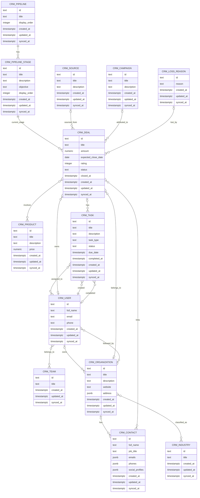
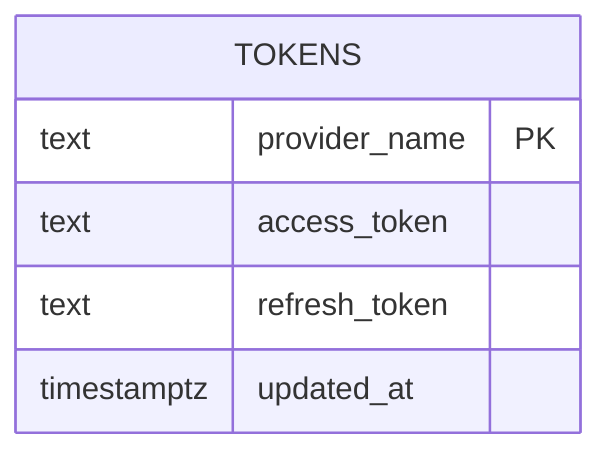

# curly-spoon

Database migrations for the **[mlclogistica.app](https://mlclogistica.app)** project. Manages schema evolution for the Postgres database using [golang-migrate/migrate](https://github.com/golang-migrate/migrate).

## Structure

```
src/migrations/
  000001_sales_schema.up.sql                                         # create the sales schema
  000001_sales_schema.down.sql
  000002_sales_core_tables.up.sql                                    # crm_campaigns, crm_loss_reasons, crm_pipelines, crm_products, crm_industries, crm_sources, crm_teams, crm_users
  000002_sales_core_tables.down.sql
  000003_sales_pipeline_stages_orgs_contacts_deals_tasks.up.sql      # crm_pipeline_stages, crm_organizations, crm_contacts, crm_deals, crm_tasks
  000003_sales_pipeline_stages_orgs_contacts_deals_tasks.down.sql
  000004_sales_deal_products_notes_and_bridge_tables.up.sql          # crm_deals_products, crm_deals_contacts, crm_organizations_industries, crm_organizations_users, crm_teams_users, crm_tasks_users
  000004_sales_deal_products_notes_and_bridge_tables.down.sql
  000005_tokens.up.sql                                               # tokens (provider auth credentials for external API integrations)
  000005_tokens.down.sql
```

## Local development

Spin up Postgres and run all migrations:

```bash
docker compose up
```

The `migrate/migrate` container waits for Postgres to be healthy, then applies all pending migrations. A clean run exits with code 0 and logs something like:

```
1/u sales_schema (4ms)
2/u sales_core_tables (12ms)
3/u sales_pipeline_stages_orgs_contacts_deals_tasks (18ms)
4/u sales_deal_products_notes_and_bridge_tables (22ms)
5/u tokens (3ms)
```

## CI

Every push to any branch triggers the `integration` workflow (`.github/workflows/integration.yaml`), which runs `docker compose up --exit-code-from migrations` to verify all migrations apply cleanly against a fresh Postgres instance.

## Deployment

Pushing a `v*.*.*` tag triggers the `deployment` workflow, which builds a multi-arch Docker image (`linux/amd64`, `linux/arm64`) and pushes it to GHCR via the shared [fuzzy-garbanzo](https://github.com/hcubasd/fuzzy-garbanzo) workflow:

```
ghcr.io/hcubasd/curly-spoon:<version>
```

This image is used by the `upgraded-disco` k8s infra to run migrations as a Job on each release.

## Migration files

Files follow the `{version}_{title}.{up|down}.sql` convention expected by `golang-migrate/migrate`.

To apply manually:

```bash
migrate -path src/migrations -database "postgres://..." up
```

To rollback one step:

```bash
migrate -path src/migrations -database "postgres://..." down 1
```

## Scripts

Helper scripts for setting up a development environment on a new machine:

- `scripts/config-helix.sh` — configures the Helix editor for this project's stack

## Schemas

### sales



> All tables in this diagram live in the `sales` schema. IDs are `text` — the CRM's own IDs are used as internal primary keys.

### public



> `tokens` lives in the default `public` schema. One row per provider (e.g. `rd_station`). Seeded manually with the initial token pair; workers refresh on every run. `refresh_token` is nullable to accommodate providers that use API keys instead of OAuth 2.
