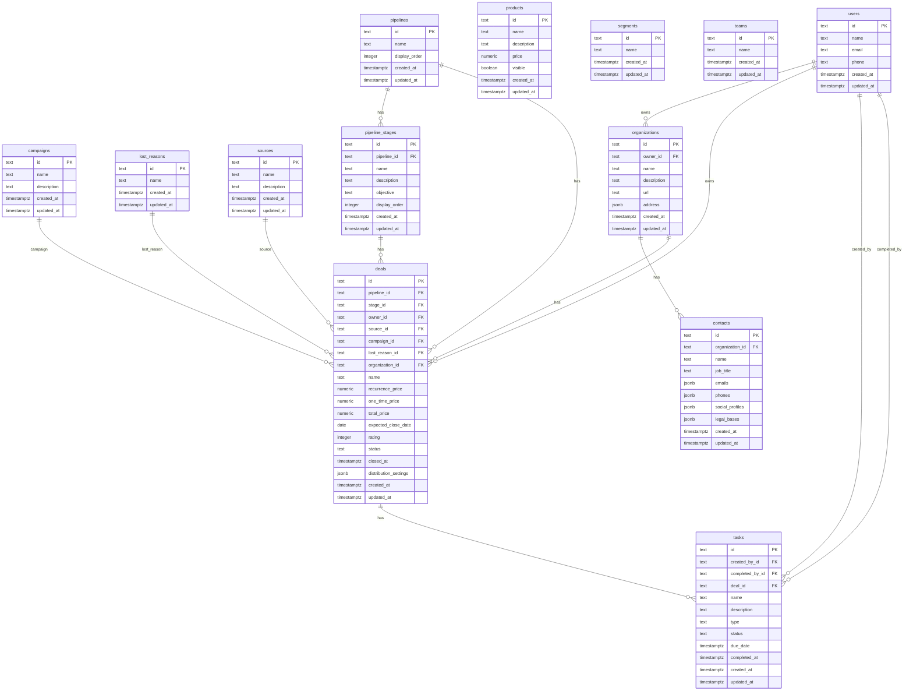

# curly-spoon

Database migrations for the **modest-galois** project. Manages schema evolution for the Postgres database using [golang-migrate/migrate](https://github.com/golang-migrate/migrate).

## Structure

```
src/migrations/
  000001_sales_schema.up.sql                                         # initial sales schema: campaigns, lost_reasons, pipelines, products, segments, sources, teams, users
  000001_sales_schema.down.sql
  000002_sales_pipeline_stages_orgs_contacts_deals_tasks.up.sql     # pipeline_stages, organizations, contacts, deals, tasks
  000002_sales_pipeline_stages_orgs_contacts_deals_tasks.down.sql
```

## Local development

Spin up Postgres and run all migrations:

```bash
docker compose up
```

The `migrate/migrate` container waits for Postgres to be healthy, then applies all pending migrations. A clean run exits with code 0 and logs something like:

```
1/u sales_schema (12ms)
2/u sales_pipeline_stages_orgs_contacts_deals_tasks (18ms)
```

## CI

Every push to any branch triggers the `integration` workflow (`.github/workflows/integration.yaml`), which runs `docker compose up --exit-code-from migrate` to verify all migrations apply cleanly against a fresh Postgres instance.

## Migration files

Files follow the `{version}_{title}.{up|down}.sql` convention expected by `golang-migrate/migrate`.

To apply manually:

```bash
migrate -path src/migrations -database "postgres://..." up
```

To rollback one step:

```bash
migrate -path src/migrations -database "postgres://..." down 1
```

## Schema



> All tables live in the `sales` schema. IDs are `text` — the CRM's own IDs are used as internal primary keys.
