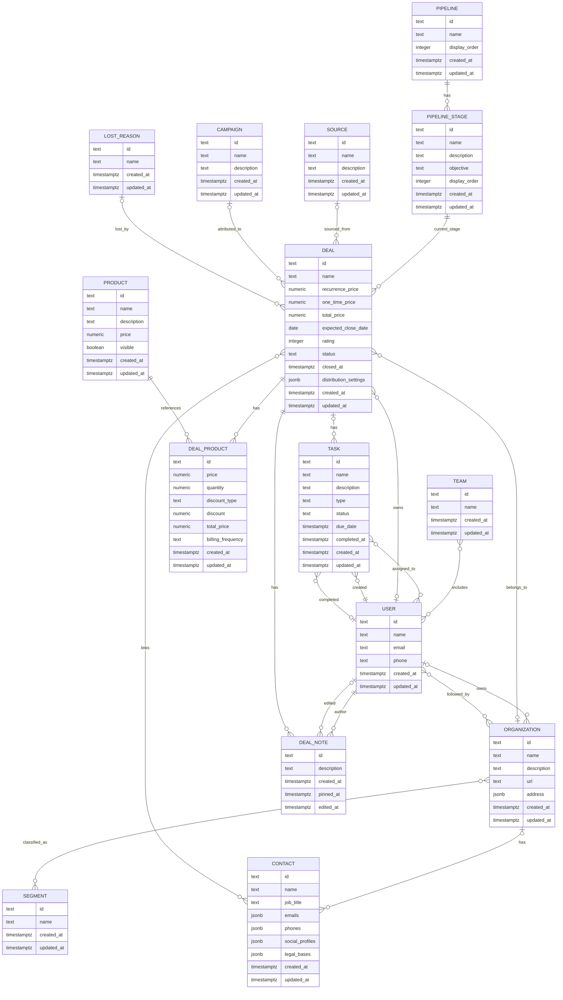
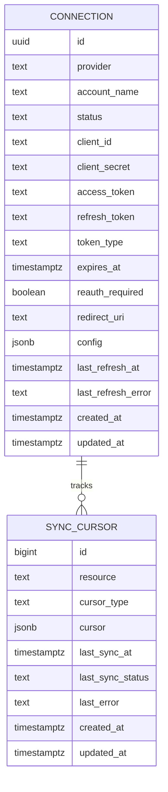

# curly-spoon

Database migrations for the **modest-galois** project. Manages schema evolution for the Postgres database using [golang-migrate/migrate](https://github.com/golang-migrate/migrate).

## Structure

```
src/migrations/
  000001_sales_schema.up.sql                                         # create the sales schema
  000001_sales_schema.down.sql
  000002_sales_core_tables.up.sql                                    # campaigns, lost_reasons, pipelines, products, segments, sources, teams, users
  000002_sales_core_tables.down.sql
  000003_sales_pipeline_stages_orgs_contacts_deals_tasks.up.sql      # pipeline_stages, organizations, contacts, deals, tasks
  000003_sales_pipeline_stages_orgs_contacts_deals_tasks.down.sql
  000004_sales_deal_products_notes_and_bridge_tables.up.sql          # deal_products, deal_notes, deal_contacts, organization_segments, organization_followers, team_users, task_owners
  000004_sales_deal_products_notes_and_bridge_tables.down.sql
  000005_integrations_schema.up.sql                                  # create the integrations schema
  000005_integrations_schema.down.sql
  000006_integrations_connections_and_sync_cursors.up.sql            # connections and sync_cursors
  000006_integrations_connections_and_sync_cursors.down.sql
```

## Local development

Spin up Postgres and run all migrations:

```bash
docker compose up
```

The `migrate/migrate` container waits for Postgres to be healthy, then applies all pending migrations. A clean run exits with code 0 and logs something like:

```
1/u sales_schema (4ms)
2/u sales_core_tables (12ms)
3/u sales_pipeline_stages_orgs_contacts_deals_tasks (18ms)
4/u sales_deal_products_notes_and_bridge_tables (22ms)
5/u integrations_schema (3ms)
6/u integrations_connections_and_sync_cursors (8ms)
```

## CI

Every push to any branch triggers the `integration` workflow (`.github/workflows/integration.yaml`), which runs `docker compose up --exit-code-from migrate` to verify all migrations apply cleanly against a fresh Postgres instance.

## Migration files

Files follow the `{version}_{title}.{up|down}.sql` convention expected by `golang-migrate/migrate`.

To apply manually:

```bash
migrate -path src/migrations -database "postgres://..." up
```

To rollback one step:

```bash
migrate -path src/migrations -database "postgres://..." down 1
```

## Schemas

### sales



> All tables in this diagram live in the `sales` schema. IDs are `text` — the CRM's own IDs are used as internal primary keys.

### integrations



> All tables in this diagram live in the `integrations` schema. `connections` stores provider auth state, including access and refresh token lifecycle fields, and `sync_cursors` stores per-resource sync progress for each connection.
